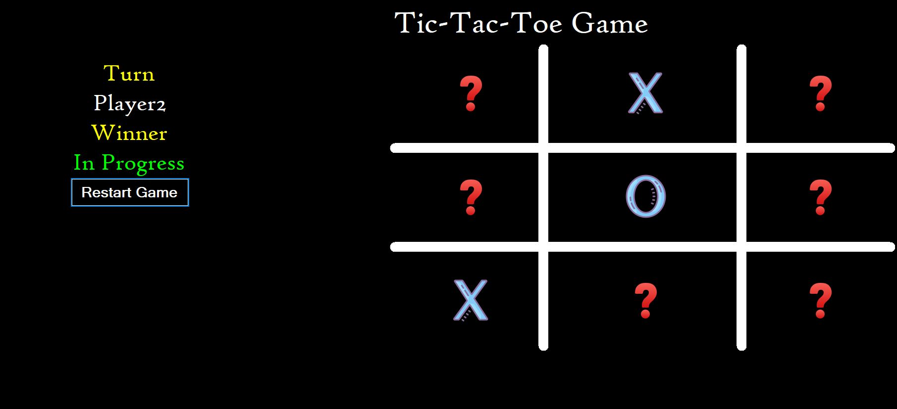
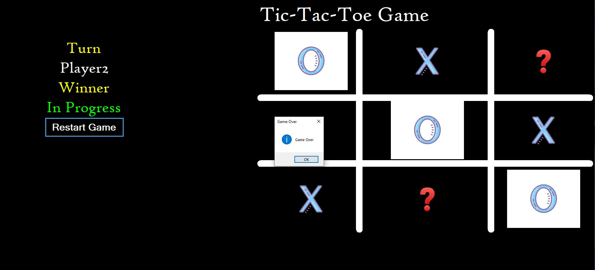

# 🕹️ Tic Tac Toe - Windows Forms (C# .NET)

A simple one-round **Tic Tac Toe** game built using **Windows Forms** in **C# .NET**.  
This is a classic 2-player game where players take turns marking X and O on a 3x3 grid. The game displays whose turn it is and shows the game status — whether it's in progress or game over (win/draw).

---

## 🎮 Features

- ✅ 2-player one-round game
- 👤 Shows current player's turn (X or O)
- 🧠 Displays game status: In Progress, Win, or Draw
- 🧹 Option to reset the board for a new game
- 🪟 Built using Windows Forms with a clean and simple UI

---

## 📸 Screenshots

| Game Start | Game Over |
|------------|-------------|------------|
|  |  |

> Make sure to place your screenshots in a `screenshots/` folder in the root of the repo.

---

## 🚀 Live Demo

🔗 Coming soon — or you can clone and run the project locally (see below).

---

## 🧰 Technologies Used

- C#
- .NET Framework
- Windows Forms

---

## 🛠️ How to Run

1. **Clone the repository**
   ```bash
   git clone https://github.com/MarwanDev/TicTacToe.git
   cd TicTacToe
